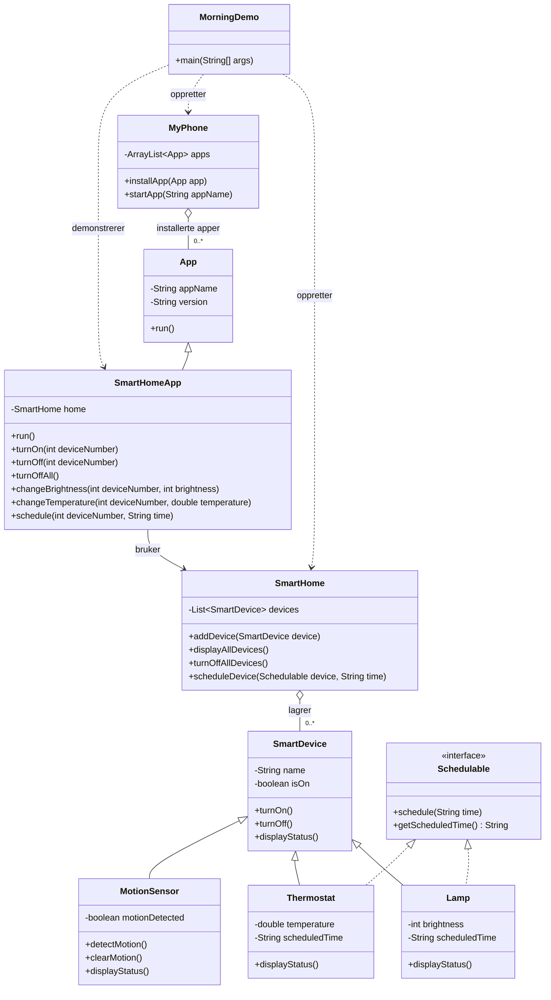

# MySmartHome

Et lite Java-prosjekt som demonstrerer smarte enheter i ett hjem, styrt både direkte og via en app på `MyPhone`. Hovedprogrammet viser en morgen der lys og varme justeres før alle enhetene slås av ved avreise.


## Hva demoen viser

Morgen-demoen oppretter to lamper, én termostat og én bevegelsessensor i samme hjem. Appen installeres på telefonen, lagrer ulike planlagte tider for lys og varme og brukes til å slå på enheter, endre lysstyrke og temperatur samt slå av alle ved avreise. Status før og etter handlingene skrives ut i terminalen. Planlagte tider lagres som informasjon; programmet utfører ikke automatisk handlinger når klokkeslettene inntreffer.

## Prosjektstruktur

```text
mysmarthome/
├── README.md
├── docs/                  # Oppgavetekst
└── src/
    └── mysmarthome/       # Smartenheter, hjem og interaktiv demo
        └── myphone/       # Telefon, app og telefon-/morgen-demoer
```

Kompilerte filer havner i den Git-ignorerte mappen `out/`.

## UML-klassediagram


