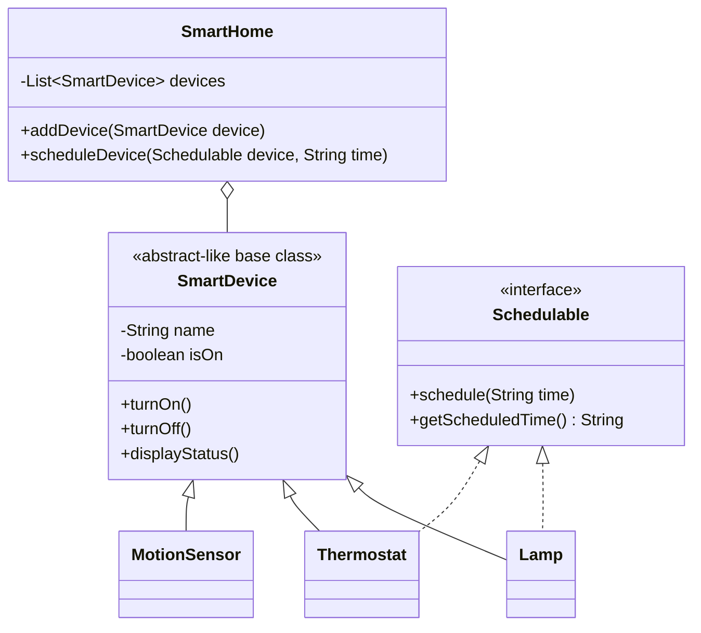
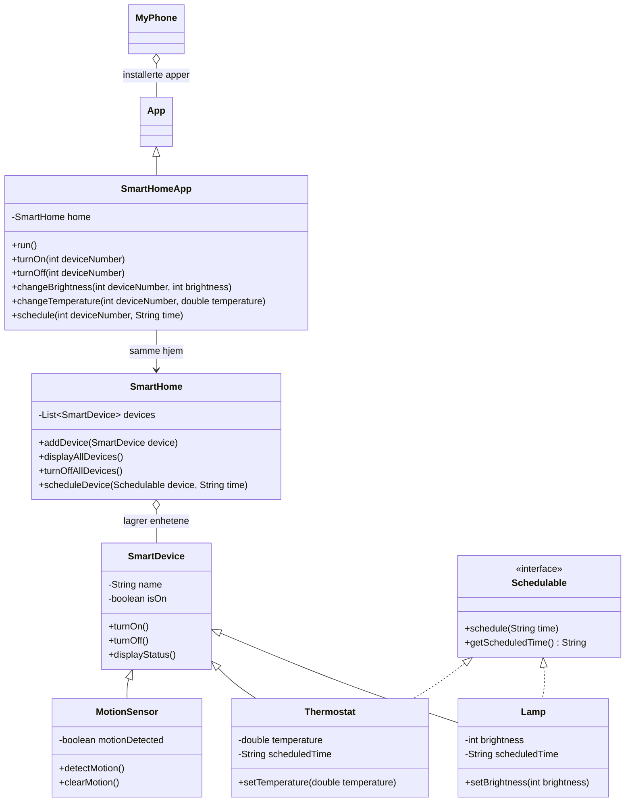

# Oppgave 2 - Ett hjem, én oversikt

# Oppgave 3 - Huset begynner å hjelpe til

## Mål

Lampen og termostaten kan lagre en planlagt tid gjennom det felles `Schedulable`-interfacet. Bevegelsessensoren er en vanlig `SmartDevice`, men har bare ansvar for å rapportere om bevegelse er oppdaget.

## Designskisse



`SmartHome` bruker fortsatt `SmartDevice` for den samlede oversikten. Bare typer som faktisk støtter planlegging implementerer `Schedulable`. Derfor trenger ikke `MotionSensor` eller en senere ikke-planleggbar enhet å inneholde en irrelevant planleggingsfunksjon. En ny planleggbar type implementerer bare `Schedulable` og kan deretter brukes av samme planleggingskode.

## Slik kjører du oppgaven

Åpne PowerShell i mappen `mysmarthome` og kjør:

```powershell
New-Item -ItemType Directory -Force -Path out
javac -d out src\mysmarthome\*.java
java -cp out mysmarthome.SmartHomeDemo
```

Ved oppstart viser demoen at:

1. `Lampe 1` er planlagt til `07:00`.
2. `Termostat 1` er planlagt til `06:30`.
3. Begge enhetene planlegges gjennom samme `List<Schedulable>` og samme løkke.
4. `Gang sensor` er registrert i `SmartHome` og viser `Bevegelse: oppdaget`.
5. Alle fire enhetene vises i hjemmets samlede oversikt.

Velg `1` eller `3` i hovedmenyen for å se og endre status på lampe eller termostat. Velg `4` for å vise sensorstatus. Velg `5` eller `6` for å slå alle enheter på eller av, og `7` for å avslutte.

## Ansvarsfordeling i oppgave 3

| Klasse/type | Ansvar |
| --- | --- |
| `SmartDevice` | Felles navn, på/av-status og statusvisning. |
| `Schedulable` | Felles kontrakt for å lagre og lese planlagt tid. |
| `Lamp` | Lysstyrke og planlagt tid. |
| `Thermostat` | Temperatur og planlagt tid. |
| `MotionSensor` | Registrerer og rapporterer bevegelse; har ingen planleggingsfunksjon. |
| `SmartHome` | Samler alle enheter og videresender planlegging til en `Schedulable`. |
| `SmartHomeDemo` | Oppretter objektene og demonstrerer kravene. |

## Kontroll før innlevering

- Lampen og termostaten har to forskjellige planlagte tider.
- Tidene kan leses fra objektene og vises i oversikten.
- Planleggbare enheter behandles samlet gjennom `Schedulable`.
- Bevegelsessensoren er med i samme `SmartHome`-samling.
- Sensoren kan vise både vanlig enhetsstatus og om bevegelse er oppdaget.
- `MotionSensor` har ikke planleggingsfelt eller planleggingsmetoder.

## Mål

Utvid programmet slik at et `SmartHome` samler og koordinerer et varierende antall `SmartDevice`-objekter. `Lamp` og `Thermostat` skal fortsatt ha ansvar for sine egne egenskaper, som lysstyrke og temperatur.

## Steg for steg

1. Opprett en ny klasse `SmartHome` i pakken `mysmarthome`.
2. Gi `SmartHome` en dynamisk samling av enheter, for eksempel `ArrayList<SmartDevice>`. Importer `java.util.ArrayList` og eventuelt `java.util.List`.
3. Legg til en metode som registrerer en enhet, for eksempel `addDevice(SmartDevice device)`. Da kan hjemmet få nye enheter også etter at objektet er opprettet.
4. Legg til en metode som viser en samlet oversikt over alle enhetene. Den skal vise navn, om enheten er på eller av, og type-spesifikk informasjon:
	- Lampe: lysstyrke
	- Termostat: temperatur
5. Legg til metoder i `SmartHome` for å slå på og av en valgt enhet. Velg enten ved indeks/menyvalg eller ved å sende inn selve `SmartDevice`-objektet.
6. Legg til en metode som slår av alle enhetene, for eksempel `turnOffAllDevices()`. Metoden skal gå gjennom samlingen og kalle `turnOff()` på hver enhet.
7. Oppdater `SmartHomeDemo`:
	- Opprett ett `SmartHome`.
	- Opprett to `Lamp`-objekter og ett `Thermostat`-objekt.
	- Registrer alle tre enhetene i hjemmet.
	- Bytt ut den faste `SmartDevice[]`-samlingen med funksjonaliteten i `SmartHome`.
	- La menyen hente oversikten og utføre på/av-handlinger gjennom `SmartHome`.

## Ansvarsfordeling

| Klasse | Ansvar |
| --- | --- |
| `SmartDevice` | Felles tilstand og oppførsel for enheter: navn, på/av og felles status. |
| `Lamp` | Lampens lysstyrke. |
| `Thermostat` | Termostatens temperatur. |
| `SmartHome` | Registrerer enheter, viser samlet oversikt og koordinerer handlinger på én eller alle enheter. |
| `SmartHomeDemo` | Oppretter objekter og demonstrerer programmet. |

`SmartHome` skal lagre enhetene som `SmartDevice`. Da kan både `Lamp`, `Thermostat` og framtidige enhetstyper ligge i samme samling uten at `SmartHome` må endres for vanlige på/av-operasjoner.

## Demonstrasjon som skal vises

1. Opprett ett hjem med to lamper og én termostat.
2. Registrer enhetene og vis oversikten. Alle skal starte som av.
3. Slå på flere enheter gjennom `SmartHome` og vis oppdatert oversikt.
4. Slå av én valgt enhet gjennom `SmartHome`. Kontroller at de andre beholder statusen sin.
5. Kall `turnOffAllDevices()` og vis sluttstatusen. Alle enheter skal være av.

## Kontroll før innlevering

- Du kan legge til en ny enhet etter at `SmartHome` er opprettet.
- Oversikten inneholder både lamper og termostater.
- Én valgt enhet kan slås på eller av uten å endre de andre.
- Alle enheter kan slås av med ett metodekall.
- `SmartHome` inneholder ikke lampens lysstyrke eller termostatens temperatur som egne felt.

# Oppgave 4 - Smarthuset på MyPhone

## Hva som er lagt til

`SmartHomeApp` arver fra `App` og får det eksisterende `SmartHome`-objektet inn i konstruktøren. `MyPhone` lagrer selve app-objektene, slik at telefonen kan installere og starte SmartHome-appen.

Appen kan vise enhetene, slå på en enhet, endre lysstyrke på en lampe, endre temperatur på en termostat og planlegge en `Schedulable`-enhet. Endringene gjøres på de samme objektene som allerede ligger i `SmartHome`.

## Kjøring

Kjør fra mappen `mysmarthome`:

```powershell
New-Item -ItemType Directory -Force -Path out
javac -d out src\mysmarthome\*.java myphone\*.java
java -cp out mysmarthome.myphone.MyPhoneDemo
```

Demoen installerer og starter appen på telefonen. Deretter endrer appen lampen til på, setter lysstyrken til `80`, setter termostaten til `21.0` og planlegger lampen til `07:00`. Til slutt vises hjemmet på nytt for å kontrollere at endringene er beholdt.

# Oppgave 5 – Demo-dag: En morgen i MySmartHome

## Hva gjenstår?

Oppgave 3-demoen har allerede to lamper, en termostat, en bevegelsessensor og to forskjellige planlagte tider. Oppgave 4-demoen installerer SmartHome-appen på MyPhone, men har bare én lampe og én termostat. **Ingen av demoene viser ennå hele morgenhistorien gjennom appen.** I tillegg har `SmartHome` en `turnOffAllDevices()`-metode, men `SmartHomeApp` har foreløpig ingen metode som lar brukeren kalle den fra appen.

| Krav | Status nå | Det du må gjøre |
| --- | --- | --- |
| To lamper, én termostat og én bevegelsessensor i samme hjem | Finnes i `SmartHomeDemo` | Opprett og registrer alle fire i **ett** `SmartHome`-objekt i morgen-demoen. |
| SmartHome-app installert og startet på MyPhone | Finnes i `MyPhoneDemo` | Gi appen akkurat dette hjemmet, installer app-objektet med `installApp()` og start det med `startApp("SmartHome")`. |
| To forskjellige planlagte tider | Finnes i `SmartHomeDemo` | Planlegg for eksempel termostaten til `06:30` og en lampe til `07:00` gjennom `SmartHomeApp.schedule()`. Vis tidene med `getScheduledTime()` eller i oversikten. |
| Felles handling og minst to typespesifikke handlinger via appen | Appen kan slå på/av en enhet, endre lysstyrke og temperatur | Bruk `turnOn()`/`turnOff()` samt både `changeBrightness()` og `changeTemperature()` i morgenhistorien. Legg til en app-metode for å slå av alle ved avreise. |
| Sensorstatus og tydelig sluttoversikt | Sensor og statusvisning finnes | Vis `isMotionDetected()`/`displayStatus()` og avslutt med `home.displayAllDevices()` etter avreise. |

## Forslag til morgenhistorie

1. Lag ett hjem med `Entrélys` (lysstyrke 30), `Kjøkkenlys` (lysstyrke 50), `Stuevarme` (temperatur 19.5) og `Gangsensor` (ingen bevegelse). Registrer dem i denne rekkefølgen; appens enhetsnumre er **nullbaserte**: 0, 1, 2 og 3.
2. Opprett `MyPhone` og `SmartHomeApp("1.0", home)`, installer **samme app-objekt** på telefonen og start den. `startApp()` viser hjemmet via appens `run()`; videre handlinger kan kalles på den samme `SmartHomeApp`-referansen.
3. Planlegg `Stuevarme` til `06:30` med `schedule(2, "06:30")` og `Entrélys` til `07:00` med `schedule(0, "07:00")`. Skriv ut begge tidene. Planleggingen **lagrer bare klokkeslett**; den slår ikke på enheter automatisk.
4. Når brukeren våkner: kall `turnOn(0)` for entrélyset og `turnOn(2)` for termostaten. Bruk deretter `changeBrightness(0, 80)` og `changeTemperature(2, 21.0)` i appen. Slå gjerne på kjøkkenlyset med `turnOn(1)`.
5. Registrer bevegelse med `Gangsensor.detectMotion()` og vis sensorstatusen. Sensoren rapporterer bevegelse uavhengig av om den er slått på eller av. Vis gjerne en mellomstatus for hele hjemmet.
6. Ved avreise: kall `Gangsensor.clearMotion()` hvis historien skal vise at gangen er tom. La deretter brukeren velge én felles handling **via appen**: legg for eksempel til `turnOffAll()` i `SmartHomeApp`, som delegerer til `home.turnOffAllDevices()`. Bruk denne metoden i demoen, ikke et direkte kall til hjemmet fra demoen.
7. Avslutt med overskriften «Sluttstatus etter avreise» og `home.displayAllDevices()`. Kontroller at alle fire enheter er **av**, sensoren viser **ikke oppdaget**, og at begge planlagte tider fortsatt vises. Lysstyrke og temperatur skal fortsatt være henholdsvis 80 og 21.0 selv om enhetene er av.

En egen `MorningDemo` eller en oppdatert `MyPhoneDemo` kan brukes som startpunkt. Hold oppgave 3-menyen og telefonens øvrige funksjoner adskilt fra denne korte, automatiske historien. Ikke beskriv morgen-demoen som ferdig før den faktisk er implementert og kjørt.

## Samlet design slik koden er nå



Dette er **dagens implementerte design**, ikke en påstand om at oppgave 5 er ferdig. Når `turnOffAll()` og morgen-demoen er laget, oppdater diagrammet og beskrivelsen slik at den endelige rapporten gjenspeiler de faktiske metodene og demonstrasjonen.

## Kontroll og kjøring

Kompiler fra mappen `mysmarthome` med kommandoene under. Den siste linjen starter **eksisterende** telefon-demo; bytt ut klassenavnet når morgen-demoen er laget.

```powershell
New-Item -ItemType Directory -Force -Path out
javac -d out src\mysmarthome\*.java myphone\*.java
java -cp out mysmarthome.myphone.MyPhoneDemo
```

Før innlevering: kjør morgen-demoen og kontroller startverdier, de ulike planlagte tidene, app-handlingene, sensorens status og sluttoversikten mot punktene over. Ta med det **oppdaterte** diagrammet og et representativt kjøreeksempel i sluttrapporten.
