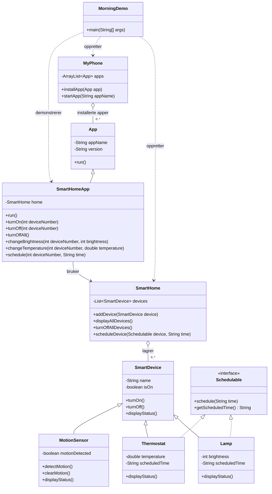

# Endelig designoversikt

## Kort forklaring av modellen

`SmartDevice` samler navn og på/av-status, mens `Lamp`, `Thermostat` og `MotionSensor` viser hver sin typespesifikke status. `SmartHome` lagrer enhetene som `SmartDevice`-objekter og kan vise en samlet oversikt eller slå dem av med én handling. Bare lampen og termostaten implementerer `Schedulable` og kan lagre planlagte tider. `MyPhone` installerer apper, og `SmartHomeApp` arver fra `App` og bruker det samme `SmartHome`-objektet for å styre enhetene. `MorningDemo` oppretter hjemmet og telefonen og viser hvordan enhetene brukes gjennom appen fra morgen til avreise.