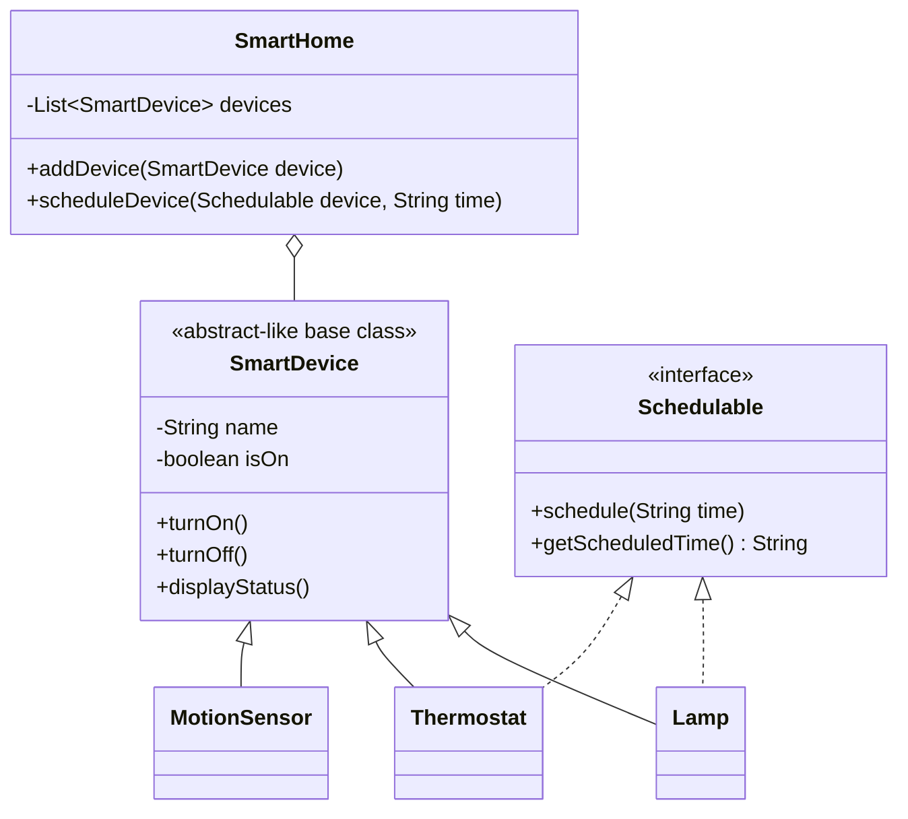
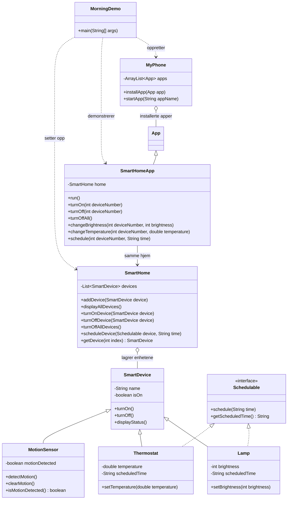

# Oppgave 2 - Ett hjem, én oversikt

# Oppgave 3 - Huset begynner å hjelpe til

## Mål

Lampen og termostaten kan lagre en planlagt tid gjennom det felles `Schedulable`-interfacet. Bevegelsessensoren er en vanlig `SmartDevice`, men har bare ansvar for å rapportere om bevegelse er oppdaget.

## Designskisse



`SmartHome` bruker fortsatt `SmartDevice` for den samlede oversikten. Bare typer som faktisk støtter planlegging implementerer `Schedulable`. Derfor trenger ikke `MotionSensor` eller en senere ikke-planleggbar enhet å inneholde en irrelevant planleggingsfunksjon. En ny planleggbar type implementerer bare `Schedulable` og kan deretter brukes av samme planleggingskode.

## Slik kjører du oppgaven

Åpne PowerShell i mappen `mysmarthome` og kjør:

```powershell
New-Item -ItemType Directory -Force -Path out
javac -d out src\mysmarthome\*.java
java -cp out mysmarthome.SmartHomeDemo
```

Ved oppstart viser demoen at:

1. `Lampe 1` er planlagt til `07:00`.
2. `Termostat 1` er planlagt til `06:30`.
3. Begge enhetene planlegges gjennom samme `List<Schedulable>` og samme løkke.
4. `Gang sensor` er registrert i `SmartHome` og viser `Bevegelse: oppdaget`.
5. Alle fire enhetene vises i hjemmets samlede oversikt.

Velg `1` eller `3` i hovedmenyen for å se og endre status på lampe eller termostat. Velg `4` for å vise sensorstatus. Velg `5` eller `6` for å slå alle enheter på eller av, og `7` for å avslutte.

## Ansvarsfordeling i oppgave 3

| Klasse/type | Ansvar |
| --- | --- |
| `SmartDevice` | Felles navn, på/av-status og statusvisning. |
| `Schedulable` | Felles kontrakt for å lagre og lese planlagt tid. |
| `Lamp` | Lysstyrke og planlagt tid. |
| `Thermostat` | Temperatur og planlagt tid. |
| `MotionSensor` | Registrerer og rapporterer bevegelse; har ingen planleggingsfunksjon. |
| `SmartHome` | Samler alle enheter og videresender planlegging til en `Schedulable`. |
| `SmartHomeDemo` | Oppretter objektene og demonstrerer kravene. |

## Kontroll før innlevering

- Lampen og termostaten har to forskjellige planlagte tider.
- Tidene kan leses fra objektene og vises i oversikten.
- Planleggbare enheter behandles samlet gjennom `Schedulable`.
- Bevegelsessensoren er med i samme `SmartHome`-samling.
- Sensoren kan vise både vanlig enhetsstatus og om bevegelse er oppdaget.
- `MotionSensor` har ikke planleggingsfelt eller planleggingsmetoder.

## Mål

Utvid programmet slik at et `SmartHome` samler og koordinerer et varierende antall `SmartDevice`-objekter. `Lamp` og `Thermostat` skal fortsatt ha ansvar for sine egne egenskaper, som lysstyrke og temperatur.

## Steg for steg

1. Opprett en ny klasse `SmartHome` i pakken `mysmarthome`.
2. Gi `SmartHome` en dynamisk samling av enheter, for eksempel `ArrayList<SmartDevice>`. Importer `java.util.ArrayList` og eventuelt `java.util.List`.
3. Legg til en metode som registrerer en enhet, for eksempel `addDevice(SmartDevice device)`. Da kan hjemmet få nye enheter også etter at objektet er opprettet.
4. Legg til en metode som viser en samlet oversikt over alle enhetene. Den skal vise navn, om enheten er på eller av, og type-spesifikk informasjon:
	- Lampe: lysstyrke
	- Termostat: temperatur
5. Legg til metoder i `SmartHome` for å slå på og av en valgt enhet. Velg enten ved indeks/menyvalg eller ved å sende inn selve `SmartDevice`-objektet.
6. Legg til en metode som slår av alle enhetene, for eksempel `turnOffAllDevices()`. Metoden skal gå gjennom samlingen og kalle `turnOff()` på hver enhet.
7. Oppdater `SmartHomeDemo`:
	- Opprett ett `SmartHome`.
	- Opprett to `Lamp`-objekter og ett `Thermostat`-objekt.
	- Registrer alle tre enhetene i hjemmet.
	- Bytt ut den faste `SmartDevice[]`-samlingen med funksjonaliteten i `SmartHome`.
	- La menyen hente oversikten og utføre på/av-handlinger gjennom `SmartHome`.

## Ansvarsfordeling

| Klasse | Ansvar |
| --- | --- |
| `SmartDevice` | Felles tilstand og oppførsel for enheter: navn, på/av og felles status. |
| `Lamp` | Lampens lysstyrke. |
| `Thermostat` | Termostatens temperatur. |
| `SmartHome` | Registrerer enheter, viser samlet oversikt og koordinerer handlinger på én eller alle enheter. |
| `SmartHomeDemo` | Oppretter objekter og demonstrerer programmet. |

`SmartHome` skal lagre enhetene som `SmartDevice`. Da kan både `Lamp`, `Thermostat` og framtidige enhetstyper ligge i samme samling uten at `SmartHome` må endres for vanlige på/av-operasjoner.

## Demonstrasjon som skal vises

1. Opprett ett hjem med to lamper og én termostat.
2. Registrer enhetene og vis oversikten. Alle skal starte som av.
3. Slå på flere enheter gjennom `SmartHome` og vis oppdatert oversikt.
4. Slå av én valgt enhet gjennom `SmartHome`. Kontroller at de andre beholder statusen sin.
5. Kall `turnOffAllDevices()` og vis sluttstatusen. Alle enheter skal være av.

## Kontroll før innlevering

- Du kan legge til en ny enhet etter at `SmartHome` er opprettet.
- Oversikten inneholder både lamper og termostater.
- Én valgt enhet kan slås på eller av uten å endre de andre.
- Alle enheter kan slås av med ett metodekall.
- `SmartHome` inneholder ikke lampens lysstyrke eller termostatens temperatur som egne felt.

# Oppgave 4 - Smarthuset på MyPhone

## Hva som er lagt til

`SmartHomeApp` arver fra `App` og får det eksisterende `SmartHome`-objektet inn i konstruktøren. `MyPhone` lagrer selve app-objektene, slik at telefonen kan installere og starte SmartHome-appen.

Appen kan vise enhetene, slå på en enhet, endre lysstyrke på en lampe, endre temperatur på en termostat og planlegge en `Schedulable`-enhet. Endringene gjøres på de samme objektene som allerede ligger i `SmartHome`.

## Kjøring

Kjør fra mappen `mysmarthome`:

```powershell
New-Item -ItemType Directory -Force -Path out
javac -d out src\mysmarthome\*.java myphone\*.java
java -cp out mysmarthome.myphone.MyPhoneDemo
```

Demoen installerer og starter appen på telefonen. Deretter endrer appen lampen til på, setter lysstyrken til `80`, setter termostaten til `21.0` og planlegger lampen til `07:00`. Til slutt vises hjemmet på nytt for å kontrollere at endringene er beholdt.

# Oppgave 5 – Demo-dag: En morgen i MySmartHome

## Slik fungerer den ferdige morgen-demoen

`MorningDemo` er en egen, automatisk demonstrasjon. De eldre demoene for oppgave 3 og 4 er beholdt uendret. Her er alle fire enhetene registrert i **samme** `SmartHome` og samme hjem er koblet til appen på `MyPhone`.

1. Hjemmet opprettes med `Entrélys` (lysstyrke 30), `Kjøkkenlys` (50), `Stuevarme` (temperatur 19.5) og `Gangsensor` (ingen bevegelse). Alle enhetene starter av. Appens indekser er **nullbaserte**: 0, 1, 2 og 3 i denne rekkefølgen; hjemmets utskrift nummererer fra 1.
2. Telefonen installerer `SmartHomeApp("1.0", home)` og starter den med `startApp("SmartHome")`. Startstatus skrives ut via appens `run()`.
3. Gjennom appen planlegges termostaten til `06:30` og entrélyset til `07:00`. Begge tidene skrives ut. `schedule()` **lagrer** klokkeslettet, men utfører ikke automatisk en på/av-handling når tiden kommer.
4. Brukeren slår på termostaten, begge lampene og sensoren gjennom appens `turnOn()`. Gjennom de typespesifikke app-metodene `changeTemperature()` og `changeBrightness()` settes temperaturen til 21.0 og entrélyset til 80. Sensoren registrerer bevegelse, og både sensorstatus og hjemmets mellomstatus vises.
5. Ved avreise nullstilles bevegelsen med `clearMotion()`. Brukeren kaller appens felles `turnOffAll()`; den delegerer til `SmartHome.turnOffAllDevices()` slik at alle enhetene slås av med én handling. Til slutt viser `home.displayAllDevices()` hele hjemmet.

`MotionSensor` har egen bevegelsestilstand i tillegg til vanlig på/av-status. Derfor nullstilles bevegelsen eksplisitt før felles avslag; `turnOffAll()` endrer ikke sensorens historikk. Planlagte tider, lysstyrke og temperatur beholdes når enhetene slås av.

## Samlet design for endelig rapport

Diagrammet viser klassene og relasjonene brukt av den **implementerte** morgen-demoen. `SmartHome` eier samlingen av enheter, mens `SmartHomeApp` får referanse til det samme hjemmet som demoen opprettet. `Schedulable` gjelder bare lampene og termostaten, ikke sensoren.



## Kjøring og kontroll

Åpne PowerShell i mappen `mysmarthome` og kjør:

```powershell
New-Item -ItemType Directory -Force -Path out
javac -d out src\mysmarthome\*.java myphone\*.java
java -cp out mysmarthome.myphone.MorningDemo
```

Sjekk overskriften «Sluttstatus etter avreise» nederst i utskriften:

| Enhet | Sluttstatus | Beholdt verdi |
| --- | --- | --- |
| Entrélys | Av | Lysstyrke 80, planlagt tid `07:00` |
| Kjøkkenlys | Av | Lysstyrke 50, ingen planlagt tid |
| Stuevarme | Av | Temperatur 21.0, planlagt tid `06:30` |
| Gangsensor | Av, bevegelse ikke oppdaget | – |

Til sluttrapporten kan du bruke diagrammet over og vise kjøreutskriften med begge planlagte tider, bevegelse oppdaget mens brukeren er hjemme, den felles app-handlingen og sluttoversikten.
